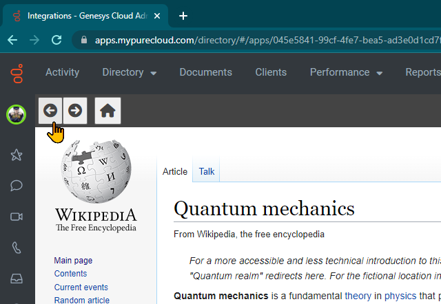

# Genesys Cloud IFrame Navigation Example

A custom client application POC which demonstrates navigation to the inner iframe.

## Sample Usage

1. Set the `target` query parameter to the desired URL.
   Ex:

   `https://princemerluza.github.io/gc-iframe-navigation/?target=https://en.wikipedia.org`

2. Enter the complete URL to your Genesys Cloud Custom Application

3. Example in action:

## NOTES

Unless the navigator and the iframe target is in the same server, the navigator doesn't actually have access to the iframe's history. This is because of security features in the browser.

In this sample, the navigator merely calls its own 'back' and 'forward' command which still effectively navigates the inner iframe.
